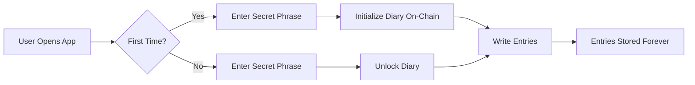

# 📔 Linera Secret Diary

> A secure, blockchain-based diary application where your deepest thoughts are protected by cryptography and stored forever on-chain.

[](https://opensource.org/licenses/MIT)
[](https://linera.dev)
[](https://www.rust-lang.org/)

## 🎯 What Is This?

**Linera Diary** is a decentralized application (dApp) that demonstrates the power of blockchain technology for personal data ownership. It's a fully functional diary where:

- **Your data is truly yours** - stored on-chain, not on someone else's server
- **Your privacy is guaranteed** - protected by SHA-256 hashed secret phrases
- **Your memories are permanent** - immutably recorded on the Linera blockchain
- **No intermediaries** - direct interaction between you and the blockchain

### Why Build This?

This project showcases:
1. **Real-world Linera development** - Learn by example how to build dApps on Linera
2. **Smart contract patterns** - CRUD operations, authentication, state management
3. **Modern web3 architecture** - Clean separation between blockchain logic and UI
4. **Practical cryptography** - Secret phrase hashing and verification

## ✨ Key Features

### 🔐 Security First
- **Secret Phrase Authentication**: Your diary is locked with a personal secret phrase
- **SHA-256 Hashing**: Phrases are hashed on-chain - never stored in plain text
- **Owner Verification**: Only the diary owner can add, edit, or delete entries
- **Immutable Storage**: Once on-chain, your data cannot be tampered with

### 📝 Full Diary Functionality
- **Create Entries**: Write down your thoughts with titles and content
- **Edit Entries**: Update your entries anytime with your secret phrase
- **Delete Entries**: Remove entries you no longer want
- **View History**: Browse all your past entries sorted by date
- **Automatic Timestamps**: Every entry records exactly when it was created

### 🎨 Beautiful Interface
- **Modern Design**: Clean, intuitive UI with smooth animations
- **Responsive Layout**: Works perfectly on desktop, tablet, and mobile
- **Real-time Updates**: See changes instantly as you interact
- **Loading States**: Clear feedback for all operations

### ⚡ Blockchain Integration
- **GraphQL API**: Modern, flexible API for querying and mutations
- **Linera SDK**: Built with the latest Linera development tools
- **WASM Compilation**: Backend compiles to WebAssembly for on-chain execution
- **Local Testing**: Full development environment for rapid iteration

## 📁 Project Structure

```text
linera-diary/
├── backend/                    # Linera Smart Contract (Rust + WASM)
│   ├── src/
│   │   ├── lib.rs             # ABI definitions & Operation enum
│   │   ├── state.rs           # On-chain state (DiaryState, DiaryEntry)
│   │   ├── contract.rs        # Business logic (CRUD operations)
│   │   └── service.rs         # GraphQL API (queries & mutations)
│   ├── tests/
│   │   └── single_chain.rs    # Integration tests
│   └── Cargo.toml             # Backend dependencies
│
├── client/                     # Web Frontend (HTML/CSS/JS)
│   ├── index.html             # Main UI structure
│   ├── styles.css             # Beautiful styling
│   ├── app.js                 # Main application logic
│   ├── api.js                 # GraphQL client wrapper
│   ├── config.js              # Configuration (chain & app IDs)
│   └── README.md              # Client documentation
│
├── Cargo.toml                  # Workspace configuration
├── README.md                   # You are here!
├── QUICKSTART.md               # 5-minute setup guide
├── API.md                      # Complete GraphQL API reference
└── LICENSE                     # MIT License
```

## 🚀 Quick Start

### Prerequisites

Before you begin, ensure you have:

- **Rust** (1.70+) - [Install here](https://rustup.rs/)
- **Linera CLI** - [Installation guide](https://linera.dev/developers/getting_started/installation.html)
- **WASM target** - Run: `rustup target add wasm32-unknown-unknown`
- **Web server** (Python, Node.js, or Live Server)

### 5-Minute Setup

```bash
# 1. Clone the repository
git clone https://github.com/dinahmaccodes/linera-diary.git
cd linera-diary

# 2. Build the backend
cd backend
cargo build --release --target wasm32-unknown-unknown

# 3. Run tests to verify everything works
cargo test

# 4. Initialize Linera (if you haven't already)
linera wallet init

# 5. Deploy to Linera
linera project publish-and-create

# 6. Start the Linera service
linera service --port 8080

# 7. In a new terminal, serve the client
cd ../client
python3 -m http.server 3000
# OR: npx http-server -p 3000

# 8. Open http://localhost:3000 in your browser
```

**📖 For detailed instructions, see [QUICKSTART.md](QUICKSTART.md)**

## 💡 How It Works

### The User Journey



### Architecture Overview

```text
┌─────────────────────┐
│   Web Browser       │
│  (Client Interface) │
└──────────┬──────────┘
           │ HTTP/GraphQL
           ▼
┌─────────────────────┐
│  Linera Service     │
│  (Port 8080)        │
└──────────┬──────────┘
           │
           ▼
┌─────────────────────┐
│  Diary Contract     │
│  - State Management │
│  - Operations       │
│  - Validation       │
└──────────┬──────────┘
           │
           ▼
┌─────────────────────┐
│  Linera Blockchain  │
│  (Immutable Storage)│
└─────────────────────┘
```

## 📖 Usage Examples

### First Time: Initialize Your Diary

1. Open the app at `http://localhost:3000`
2. Enter a memorable secret phrase (min 8 characters)
3. Click "Unlock Diary"
4. The app automatically creates your diary on-chain

### Writing Your First Entry

1. Enter your secret phrase to unlock
2. Fill in the "Title" field (e.g., "My First Day")
3. Write your thoughts in the content area
4. Click "💾 Save Entry"
5. Your entry is now stored permanently on the blockchain!

### Viewing Past Entries

- All entries are displayed below the form
- Sorted by date (newest first)
- Shows title, content, and timestamp
- Click "✏️ Edit" to modify an entry
- Click "🗑️ Delete" to remove an entry

### GraphQL API Examples

**Query all entries:**

```

**Add a new entry:**

```graphql
mutation {
  addEntry(
    secretPhrase: "your-secret-phrase"
    title: "Today's Adventure"
    content: "Went hiking and saw amazing views..."
  ) {
    success
    message
  }
}
```

**Update an entry:**

```graphql
mutation {
  updateEntry(
    secretPhrase: "your-secret-phrase"
    entryId: 1
    title: "Updated Title"
    content: "Updated content..."
  ) {
    success
    message
  }
}
```

**Delete an entry:**

```graphql
mutation {
  deleteEntry(
    secretPhrase: "your-secret-phrase"
    entryId: 1
  ) {
    success
    message
  }
}
```

**📚 For complete API documentation, see [API.md](API.md)**

## 🔒 Security & Privacy

### How Your Data is Protected

1. **Secret Phrase Hashing**
   - Your phrase is hashed with SHA-256 before touching the blockchain
   - The original phrase never leaves your browser
   - Hash cannot be reversed to reveal your phrase

2. **Owner Verification**
   - Every operation checks that you're the diary owner
   - Chain ID verification ensures proper authentication
   - No one else can modify your entries

3. **Immutable Storage**
   - Once written, entries cannot be altered by external parties
   - Blockchain guarantees data integrity
   - Your history is permanent and tamper-proof

### ⚠️ Important Security Notes

- **Remember your secret phrase** - it cannot be recovered if lost
- **Use a strong phrase** - minimum 8 characters recommended
- **Don't share your phrase** - anyone with it can access your diary
- **Consider encryption** - for extra sensitive content, encrypt before storing

## 🏗️ Technical Architecture

### Smart Contract Components

#### `lib.rs` - Application Binary Interface
- Defines `DiaryAbi` trait
- `Operation` enum for all actions (Initialize, AddEntry, UpdateEntry, DeleteEntry)
- `OperationResponse` for mutation results
- `hash_secret_phrase()` helper function

#### `state.rs` - On-Chain State
- `DiaryState` struct with:
  - `secret_phrase_hash`: RegisterView<String>
  - `owner`: RegisterView<String>
  - `entry_count`: RegisterView<u64>
  - `entries`: MapView<u64, DiaryEntry>
- Helper methods for querying entries

#### `contract.rs` - Business Logic
- Implements Linera `Contract` trait
- `execute_operation()` - processes all mutations
- Validates secret phrases before operations
- Checks owner permissions
- Updates state atomically

#### `service.rs` - GraphQL Service
- Implements Linera `Service` trait
- `QueryRoot` - read operations (entries, owner, count)
- `MutationRoot` - write operations (schedule blockchain transactions)
- Returns structured responses for UI consumption

### Frontend Architecture

#### `index.html` - Structure
- Semantic HTML5 markup
- Authentication screen
- Diary interface (write + read)
- Edit modal
- Accessibility-friendly

#### `styles.css` - Presentation
- CSS custom properties for theming
- Responsive design (mobile-first)
- Smooth animations and transitions
- Card-based layout with glassmorphism

#### `app.js` - Main Logic
- DiaryApp class managing state
- Event handlers for all user actions
- Loading states and error handling
- DOM manipulation for dynamic content

#### `api.js` - GraphQL Client
- DiaryAPI class wrapping fetch calls
- Methods for all GraphQL operations
- Error handling and response parsing
- Configurable endpoint

## 🧪 Testing

### Run All Tests

```bash
cd backend
cargo test
```

### Test Coverage

- ✅ Operation type compilation
- ✅ Secret phrase hashing
- ✅ State helper methods
- ✅ Contract initialization
- 🚧 Full integration tests (coming soon)

### Manual Testing Checklist

- [ ] Initialize diary with secret phrase
- [ ] Add multiple entries
- [ ] View all entries
- [ ] Edit an existing entry
- [ ] Delete an entry
- [ ] Try wrong secret phrase (should fail)
- [ ] Refresh page and verify persistence

## 🛠️ Development

### Local Development Setup

```bash
# Clone and setup
git clone https://github.com/dinahmaccodes/linera-diary.git
cd linera-diary

# Install dependencies
rustup target add wasm32-unknown-unknown
linera wallet init

# Build and test
cd backend
cargo build --release --target wasm32-unknown-unknown
cargo test

# Deploy locally
linera project publish-and-create

# Start services
linera service --port 8080 &
cd ../client && python3 -m http.server 3000
```

### Project Commands

```bash
# Backend
cargo build --release --target wasm32-unknown-unknown  # Build for deployment
cargo test                                              # Run tests
cargo clippy                                            # Lint code
cargo fmt                                               # Format code

# Deploy
linera project publish-and-create                       # Deploy to chain
linera service --port 8080                              # Start GraphQL service

# Client
cd client
python3 -m http.server 3000                             # Serve with Python
# OR
npx http-server -p 3000                                 # Serve with Node
```

## 📚 Documentation

- **[QUICKSTART.md](QUICKSTART.md)** - Get up and running in 5 minutes
- **[API.md](API.md)** - Complete GraphQL API reference
- **[client/README.md](client/README.md)** - Frontend documentation
- **[Linera Docs](https://linera.dev)** - Official Linera documentation

## 🗺️ Roadmap

### Current Version (v1.0)

- ✅ Basic diary functionality (CRUD)
- ✅ Secret phrase authentication
- ✅ GraphQL API
- ✅ Web interface
- ✅ On-chain storage

### Planned Features

- [ ] Entry encryption (end-to-end)
- [ ] Rich text editor (Markdown support)
- [ ] Entry tagging and categories
- [ ] Search functionality
- [ ] Export to JSON/PDF
- [ ] Multiple diaries per user
- [ ] Shared entries (with access control)
- [ ] Mobile app (React Native)

## 🤝 Contributing

Contributions are welcome! Here's how you can help:

1. **Fork** the repository
2. **Create** a feature branch (`git checkout -b feature/amazing-feature`)
3. **Commit** your changes (`git commit -m 'Add amazing feature'`)
4. **Push** to the branch (`git push origin feature/amazing-feature`)
5. **Open** a Pull Request

### Development Guidelines

- Follow Rust best practices and idioms
- Write tests for new functionality
- Update documentation for API changes
- Use meaningful commit messages
- Keep PRs focused and small

## 🐛 Troubleshooting

### Common Issues

**"Failed to compile for wasm32-unknown-unknown"**
- Run: `rustup target add wasm32-unknown-unknown`
- Clean and rebuild: `cargo clean && cargo build --release --target wasm32-unknown-unknown`

**"Failed to connect to Linera service"**
- Ensure `linera service --port 8080` is running
- Check firewall settings
- Verify the correct chain ID and application ID in `config.js`

**"Secret phrase incorrect"**
- Secret phrases are case-sensitive
- Ensure you're using the same phrase you initialized with
- No recovery possible if phrase is lost

**"CORS errors in browser"**
- Use a proper HTTP server (not `file://`)
- Linera service handles CORS automatically

### Getting Help

- **Issues**: [GitHub Issues](https://github.com/dinahmaccodes/linera-diary/issues)
- **Discussions**: [GitHub Discussions](https://github.com/dinahmaccodes/linera-diary/discussions)
- **Linera Discord**: [Join the community](https://discord.gg/linera)

## 📄 License

This project is licensed under the MIT License - see the [LICENSE](LICENSE) file for details.

## 🙏 Acknowledgments

- **Linera Team** - For building an amazing blockchain platform
- **Rust Community** - For excellent tooling and libraries
- **You** - For checking out this project!

## 📞 Contact

**Dinah Macaulay**

- GitHub: [@dinahmaccodes](https://github.com/dinahmaccodes)
- Project Link: [https://github.com/dinahmaccodes/linera-diary](https://github.com/dinahmaccodes/linera-diary)

---

<div align="center">

**⭐ Star this repo if you find it helpful!**

Made with ❤️ using [Linera](https://linera.dev)

</div>

### Frontend

Built with:
- React + TypeScript
- Vite for fast builds
- GraphQL Client (@apollo/client)
- TailwindCSS for styling

## Deployment

### Testnet Deployment

```bash
# Set your chain ID
export CHAIN_ID="your-chain-id"

# Publish application
linera publish-and-create \
  target/wasm32-unknown-unknown/release/diary_backend_{contract,service}.wasm \
  --required-application-ids $CHAIN_ID
```

### Mainnet Deployment

⚠️ Before mainnet deployment:
1. Complete thorough testing
2. Security audit
3. Review all operations
4. Ensure proper error handling

## Contributing

Contributions are welcome! Please:
1. Fork the repository
2. Create a feature branch
3. Add tests for new features
4. Submit a pull request

## License

MIT License - See LICENSE file for details

## Resources

- [Linera Documentation](https://linera.dev)
- [Linera Protocol Repository](https://github.com/linera-io/linera-protocol)
- [GraphQL Documentation](https://graphql.org)

## Support

For issues and questions:
- Open an issue on GitHub
- Join the Linera Discord community

---

Built with ❤️ using Linera Protocol
